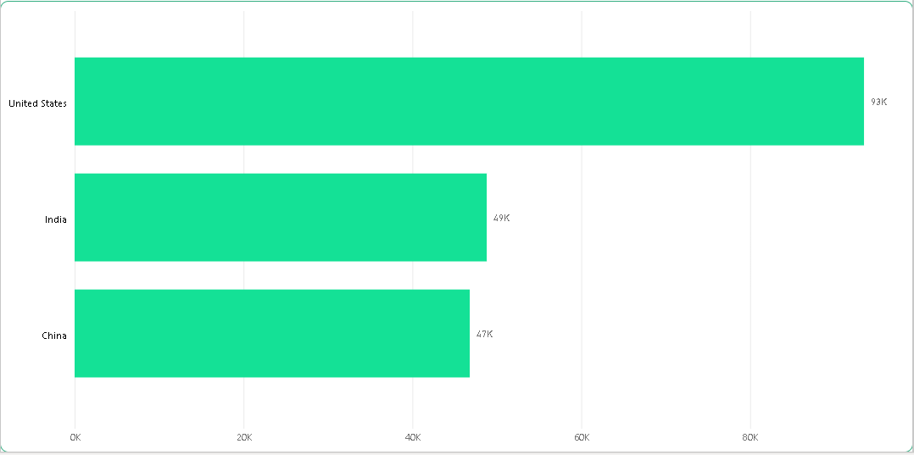

# Global Superstore Data Analysis
## Table of Contents

- [Introduction](Introduction)
- [Methodology](Methodology)
- [Visualization](Visualization)

## Introduction
This report presents the results of a data analysis on the Superstore dataset, which contains information about the sales and profits of Global Superstore, an online retailer that operates in 147 countries and sells over 10,000 products in various categories. The purpose of this analysis is to identify the key factors that influence the performance and profitability of Global Superstore and to provide recommendations to management on how to optimize their business strategy and operations.

The report is organized as follows: Section 1 provides an overview of the Superstore dataset, including its structure, variables, and descriptive statistics. Section 2 explores the relationships between different variables and their impact on sales and profits, using various data visualization and statistical techniques. Section 3 summarizes the main findings and insights from the analysis, and suggests some possible actions that management can take to improve their performance and profitability.

## Methodology

In this project, we used three data sets: order data, return data, and people data. The order data included information such as Row ID, Order ID, Order Date, Ship Date, Ship Mode, Customer ID, Customer Name, Segment, City, State, Country, Postal Code, Market, Region, Product ID, Category, Sub-Category, Product Name, Sales, Quantity, Discount, Profit, Shipping Cost, and Order Priority. The return data contained the return ID and the market of each returned order. The people data consisted of the customer name and the region they belonged to.

### Cleaning

We used the Power Query tool to clean the data sets. From the order data, we noticed that more than 80% of the postal code values were missing, so we discarded that column. We also corrected the data types for the date columns and changed them to date format. We applied the currency format to the columns that represented monetary values, such as shipping cost, profit, discount, and sales. The return and people data did not have any null values or incorrect data types, so we used them as they were.

### Data preparation

After cleaning the individual data sets, we merged them to facilitate the analysis. We used Power Query to join the order and return data sets based on the order ID column. We also created a conditional column called Returned, which indicated whether an order was returned or not. Then we merged the resulting data set with the people data set based on the customer name column. This gave us a comprehensive data set that contained all the relevant information for our project.

## Visualization
1.	What are the three countries that generated the highest total profit for Global Superstore in 2014? For each of these three countries, find the three products with the highest total profit. Specifically, what are the products’ names and the total profit for each product?
   
Global Superstore is a multinational retail company that sells a variety of products across different regions and markets. In 2014, the company reported a total profit of $504.26K, However, not all countries contributed equally to this profit margin. In fact, only three countries accounted for more than half of the total profit generated by Global Superstore in 2014. These countries were:
United States: The United States was the largest and most profitable market for Global Superstore, with a total profit of $93.484.72.
India: India was the second most profitable country for Global Superstore, with a total profit of $48,807.68. 
China: China was the third most profitable country for Global Superstore, with a total profit of $46,793.99.

We compared the profit margins of three categories: technology, office supplies, and furniture, across three countries: the United States of America, India, and China.

According to our analysis, the United States of America has the highest profit margin in technology products, with a total profit of approximately 54.21% of the sales. The second most profitable category is office supplies, with a total profit of 42.56% of the sales. The third most profitable category is furniture, with a total profit of 3.23% of the sales.

In India, the most profitable category is furniture, with a total profit of around 38% of the sales. The second most profitable category is office supplies, with a total profit of 36% of the sales. The third most profitable category is technology, with a total profit of 25% of the sales.

In China, the most profitable category is technology, with a total profit of 46% of the sales. The second most profitable category is office supplies, with a total profit of 27% of the sales. The third most profitable category is furniture, with a total profit of 26% of the sales.

Our analysis suggests that technology products are generally more profitable than office supplies and furniture products, except in India where furniture products have a higher profit margin. We also observe that there are significant variations in the profitability of different categories across different countries, which may indicate different market preferences and demands.

The 3 subcategories with the highest average shipping cost in the United States. 
One of the factors that affect the profitability of a business is the shipping cost of its products. Here, we examined the shipping cost trends of three subcategories of products: tables, copiers, and machines, in the United States from 2011 to 2014. We will also focus on the year 2014 as a case study to compare the shipping costs of these subcategories.

According to our data, tables had the highest average shipping cost among the three subcategories from 2011 to 2014, with an average of $70 per order. Copiers came second with an average of $165 per order, and machines came third with an average of $132 per order. These figures suggest that tables are more expensive to ship than copiers and machines, possibly due to their size, weight, and fragility.

However, when we look at the year 2014 alone, we see a different picture. Copiers had the highest average shipping cost in 2014, with an average of $161 per order. Machines came second with an average of $115 per order, and tables came third with an average of $67 per order. This indicates that copiers and machines became more costly to ship in 2014 than in previous years, perhaps due to increased demand, scarcity, or inflation.
.png) 

Assess Nigeria’s profitability (i.e., total profit) for 2014. How does it compare to other African
Countries? What factors might be responsible for Nigeria’s poor performance? You might want to investigate
Shipping costs and the average discount as potential root causes.

The chart above shows the profit of different African countries in 2014. We can see that most of the countries had a positive profit, while only three of them had a negative profit. The highest positive profit was achieved by South Africa, with 9.3k, followed by Morocco, Egypt, and the Democratic Republic of Congo. Senegal, Algeria, Tanzania, Ghana, Sudan, Cote d'Ivoire, and Mozambique also had positive profits, but lower than the top four. On the other hand, the lowest negative profit was recorded by Nigeria, with -23k, followed by Zimbabwe and Uganda. These three countries were underperforming compared to the rest of the continent.

We examined the reasons for Nigeria's low performance and looked at the different categories, subcategories and states. Our findings show that the technology category is lagging behind and that phones are not profitable in Nigeria, especially in Niger state. We suggest that the Global Store should diversify its product offerings based on the demand in each state and enhance the quality and promotion of the phones.

The product subcategory that is the least profitable in Southeast Asia.Southeast Asia comprises Cambodia, Indonesia, Malaysia, Myanmar(Burma), the Philippines, Singapore, Thailand, and Vietnam.Is there a specific country i n Southeast Asia where Global Superstore should stop offering the subcategory identified in the above analysis?

Based on our analysis product subcategories in Southeast Asia envelopes, supplies, labels, and fasteners are the least profitable, but still generate positive profits. However, tables are the only product subcategory that has a negative profit of around -64K. This indicates that tables are underperforming in this region and need to be addressed.

Indonesia has the highest negative table profit of around -10K, followed by the Philippines, Thailand, and Vietnam with -3K each. Myanmar is the only country where almost all products are underperforming, but tables have a relatively low negative profit of around -1K. This suggests that there are different factors affecting the table sales in each country, such as demand, competition, pricing, and quality. Global stores should consider stopping providing tables in Indonesia.

Which city is the least profitable (in terms of average profit) in the United States? For this analysis,
Discard the cities with less than 10 Orders. b) Why is this city’s average profit so low?

The chart above shows the average profit of different cities in the USA. It is clear that more than 10 cities are underperforming and have a negative average profit. The worst performers are Charlotte, Philadelphia, and Concord, with average profits of -170, -345 and -1862 respectively. This raises the question: why is Concord's average profit so low compared to the other cities? One possible explanation is that Concord has a high cost of doing business, such as taxes, rent, wages, etc. Another possibility is that Concord has a low demand for the products or services offered by the businesses, due to factors such as competition, customer preferences, market saturation, etc. A third possibility is that Concord has a poor quality of management, such as inefficient operations, ineffective marketing, lack of innovation, etc. These are some of the potential reasons that could account for Concord's dismal performance in terms of profit.

a)	Which product subcategory has the highest average profit in Australia?

The subcategory products that generate the most profit in Australia are appliances, copiers and phones, according to the chart above. These products have an average profit of $139, $105 and $99 per unit, respectively, which are significantly higher than the other subcategories

Who are the most valuable customers and what do they purchase?

To identify the most valuable customers in our sales data, we used several criteria to rank them. First, we looked at the number of items they bought and the average profit per item. Second, we looked at the category of items they bought, such as technology, office supplies, or furniture. Third, we looked at whether they returned any items or not. Based on these criteria, we found that the most valuable customers in each category were:

- Technology: Jennifer Ferguson, who bought 6 items with an average profit of 207.48 dollars 
- Office Supplies: Jane Waco, who bought 8 items with an average profit of 88.7 dollars and 
- Furniture: Danny Ordway, who bought 5 items with an average profit of 188.27 dollars and 

To summarize Global Superstore is a successful company that sells various products in different categories and regions. From 2011 to 2014, it achieved impressive results, with more than 12 million sales, 178 thousand units sold, and 1.47 million profit. The company's main product categories are technology, furniture, and office supplies. Among them, technology products have the highest profit margin, while office supplies have the lowest. However, office supplies are the most popular products in terms of quantity sold, followed by furniture and technology. The company's customer base is global, but the majority of its sales come from three regions: Central, South, and EMEA. These regions have shown consistent demand for the company's products over the years.

you can get the dashboard [here](https://app.powerbi.com/links/W0vJmXudbk?ctid=41896c65-9391-4083-8d92-38447ac4911f&pbi_source=linkShare&bookmarkGuid=478a367e-cac2-4df7-ab7f-e1e0481350ce)

